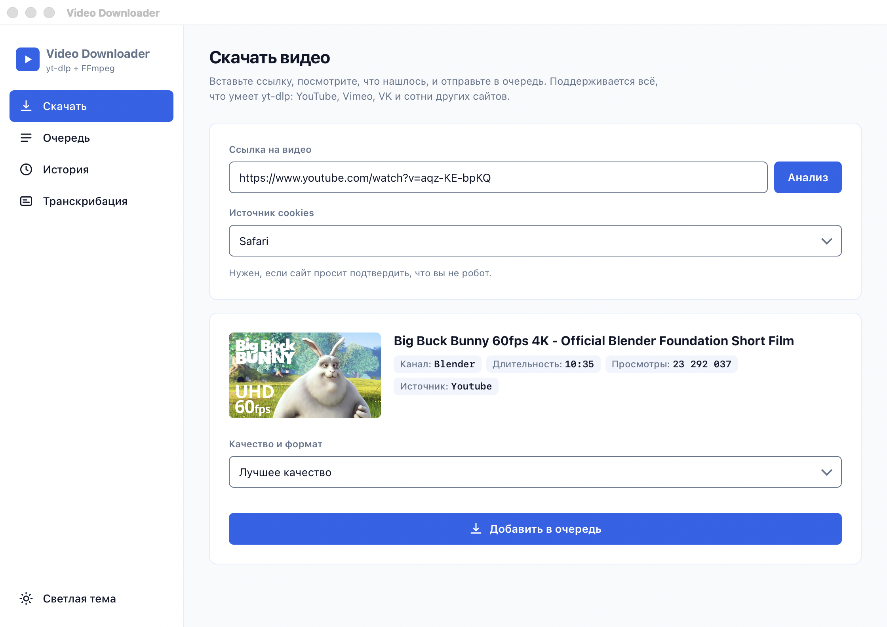

# Go Video Downloader

Простой и мощный инструмент для загрузки видео с YouTube и других платформ. Написан на Go, использует мощь `yt-dlp` и `FFmpeg`. Работает тремя способами: **приложение со своим окном** (macOS и Windows), **веб-оболочка** в браузере и **консольный режим**.
Если возникают какие то ошибки, обновите yt-dlp.



## Что умеет

- **Скачать** — вставить ссылку, посмотреть название, длительность и доступные качества, выбрать формат (видео до 1080p, только аудио m4a или mp3).
- **Очередь** — несколько загрузок сразу (две одновременно, остальные ждут), прогресс, скорость, отмена и повтор.
- **История** — последние 200 файлов с кнопкой «показать в Finder/Проводнике».
- **Транскрибация** — распознавание речи локально через whisper, вывод в SRT, VTT или TXT.
- **Две темы** — светлая и тёмная, по умолчанию как в системе, переключатель в левом нижнем углу.

---

## Установка для пользователей (вариант A — готовый релиз)

Самый простой способ — **без Go и без ручных установок**:

1.  Откройте раздел **[Releases](../../releases)** и скачайте архив под свою ОС:
    - **Windows:** `v-down_<версия>_windows_amd64.zip`
    - **macOS (Apple Silicon):** `..._macos_arm64.tar.gz` · **(Intel):** `..._macos_amd64.tar.gz`
    - **Linux:** `..._linux_amd64.tar.gz`
2.  Распакуйте архив.
3.  Запустите программу:
    - **Windows:** двойной клик по `v-down.exe`
    - **macOS/Linux:** `./v-down` в терминале
4.  **Первый запуск:** `yt-dlp` и `FFmpeg` скачаются автоматически (нужен интернет), затем
    откроется браузер с веб-оболочкой — можно пользоваться локально.

### Если система предупреждает о «неизвестном разработчике»

Бинарники не подписаны, поэтому ОС может заблокировать первый запуск. Это разовое действие:

- **Windows (SmartScreen):** «Подробнее» → «Выполнить в любом случае».
- **macOS (Gatekeeper):** правый клик по файлу → «Открыть»; либо в терминале:
  `xattr -d com.apple.quarantine v-down`

---

## Предварительные требования

> **Начиная с версии «update» зависимости устанавливать необязательно** — при первом
> запуске программа сама найдёт `yt-dlp` и `FFmpeg` в системе или скачает их в папку
> `tools/` рядом с собой. Подробнее: [docs/dependencies.md](docs/dependencies.md).
>
> Раздел ниже — на случай, если вы хотите поставить их вручную (или автоскачивание
> недоступно).

Ручная установка зависимостей (если нужно):

| ОС                 | Команда для терминала                               |
| :----------------- | :-------------------------------------------------- |
| **Windows**        | `winget install yt-dlp ffmpeg`                      |
| **macOS**          | `brew install yt-dlp ffmpeg`                        |
| **Linux (Ubuntu)** | `sudo apt update && sudo apt install yt-dlp ffmpeg` |

---

## Установка из исходников (вариант B)

> Для разработки или если нет готового релиза под вашу платформу. Понадобится
> установленный **Go**.

Пошагово:

1.  **Установите Go 1.18+** — [go.dev/dl](https://go.dev/dl/). Проверка:

    ```bash
    go version
    ```

2.  **Склонируйте репозиторий и перейдите в папку проекта:**

    ```bash
    git clone <URL-репозитория>
    cd go_yt_dwn
    ```

3.  **Соберите исполняемый файл** (точка в конце — собрать весь пакет, а не один файл):

    ```bash
    go build -o v-down .
    ```

    На Windows удобно сразу с расширением: `go build -o v-down.exe .`

4.  **Запустите программу:**
    - **Linux/macOS:** `./v-down`
    - **Windows:** `.\v-down.exe`

5.  **Первый запуск:** если `yt-dlp` и `FFmpeg` не найдены в системе, программа сама
    скачает их в папку `tools/` рядом с собой (нужен интернет). Затем автоматически
    откроется браузер с веб-оболочкой — можно пользоваться локально.

---

## Приложение со своим окном

Кроме консольного бинарника собираются две нативные оболочки: они показывают тот же
интерфейс, но в обычном окне программы — без вкладки браузера и без адресной строки.
Сервер живёт дочерним процессом и гаснет вместе с окном.

### macOS

```bash
make app        # dist/Video Downloader.app
```

Нужны `swiftc` и `iconutil` (входят в Command Line Tools). Приложение запускается
двойным кликом, имеет иконку, меню «Правка» (копирование и вставка) и меню «Вид»
с масштабом (⌘+, ⌘−, ⌘0). ⌘Q гасит сервер вместе со всеми его yt-dlp и FFmpeg —
процессов-сирот не остаётся. Второй запуск не поднимает вторую копию, а выводит
вперёд уже открытое окно.

Особенности macOS-версии:

- файлы сохраняются в `~/Downloads/Video Downloader/downloads`; при первом запуске
  система спросит разрешение на доступ к папке «Загрузки» — это нормально;
- `yt-dlp` и `FFmpeg` живут в `~/Library/Application Support/Video Downloader/tools`,
  а не внутри бандла: внутрь `.app` писать нельзя, это ломает подпись;
- файл для транскрибации можно **перетащить прямо в окно** — приложение знает
  системный путь, обычный браузер его не отдаёт;
- лог приложения: `~/Library/Logs/video-downloader.log`.

### Windows

```bash
make windows-app    # dist/video-downloader-windows.zip
```

Кросс-сборка идёт с мака (чистый Go, без cgo). В архиве два файла — `VideoDownloader.exe`
(окно) и `v-down.exe` (движок), распаковывать нужно оба в одну папку. Окно рисует
**WebView2**: в Windows 11 он встроен, на Windows 10 ставится
[отдельно](https://developer.microsoft.com/microsoft-edge/webview2/). Консоли нет,
иконка своя, размер и положение окна запоминаются, закрытие окна гасит движок
(страховка — job object, сирот не остаётся). Файлы сохраняются в
`%USERPROFILE%\Downloads\Video Downloader\downloads`, лог —
`%LOCALAPPDATA%\video-downloader\app.log`.

### Остальные цели сборки

| Команда            | Что делает                                              |
| :----------------- | :------------------------------------------------------ |
| `make build`       | `bin/v-down` — веб- и консольный режимы                  |
| `make run`         | собрать и запустить веб-оболочку                         |
| `make app`         | `.app` для macOS                                         |
| `make windows`     | `v-down.exe` — консольный сервер под Windows             |
| `make windows-app` | `VideoDownloader.exe` + архив                            |
| `make dist`        | релизные архивы всех платформ (`build.sh`)               |
| `make vet`         | `go vet ./...`                                           |

---

## Инструкция по использованию

По умолчанию программа запускает **веб-оболочку** и открывает её в браузере:

1. Запустите программу (`./v-down`) — откроется страница на `http://127.0.0.1:8080`.
2. (Опционально) выберите источник cookies из выпадающего списка.
3. Вставьте ссылку на видео и нажмите **Анализ** — появятся превью, название, длительность и просмотры.
4. Нажмите **Добавить в очередь** — задача уйдёт в раздел «Очередь», где видно прогресс,
   скорость и оставшееся время; файл сохраняется в папку `downloads/`.

Скриншоты остальных экранов — в [docs/screenshots](docs/screenshots).

### Транскрибация

Раздел «Транскрибация» распознаёт речь локально: интернет нужен один раз, чтобы
скачать модель. Выбираете файл (из истории загрузок, кнопкой или перетаскиванием
в окно приложения), язык, модель и формат вывода — результат ложится рядом с
исходником. Модели различаются размером и точностью: `base` ~150 МБ, `small` ~465 МБ,
`medium` ~1,5 ГБ, `large-v3` ~3 ГБ.

> Whisper **не различает говорящих**: диаризации нет, реплики разных людей идут
> одним потоком текста.

### Оформление

Своей дизайн-системы у проекта не было, поэтому стиль, палитра и шрифтовая пара
взяты из базы `ui-ux-pro-max`: **Flat Design + Minimalism** (ни теней, ни градиентов,
иерархию задаёт цвет), палитры «File Manager & Transfer» для светлой темы и
«Developer Tool / IDE» для тёмной, шрифтовая пара «Dashboard Data» (подписи —
системный гротеск, данные — системный моноширинный). Веб-шрифтов нет намеренно:
программа обязана работать без интернета.

### Консольный режим

Старый интерфейс в терминале доступен через флаг:

```bash
./v-down -cli
```

Другой порт/адрес для веб-режима — флаг `-addr`:

```bash
./v-down -addr 127.0.0.1:9000
```

> Если программа выдает ошибку "FFmpeg не найден", убедитесь, что путь к папке `bin` вашего FFmpeg добавлен в системную переменную **PATH**.

---
