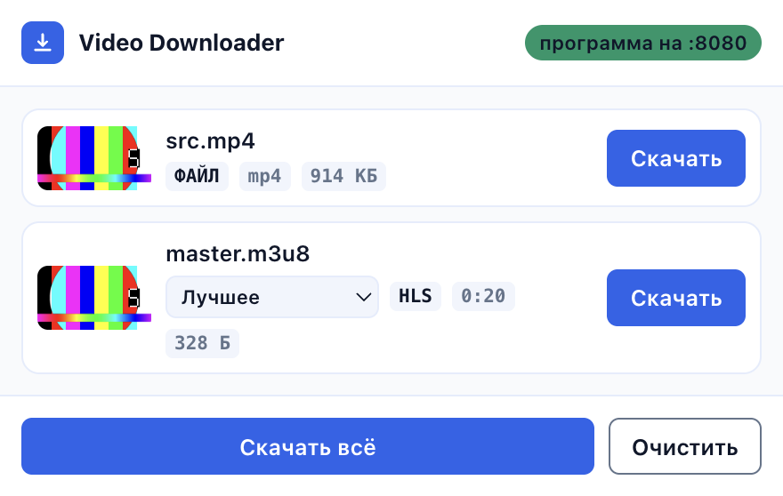
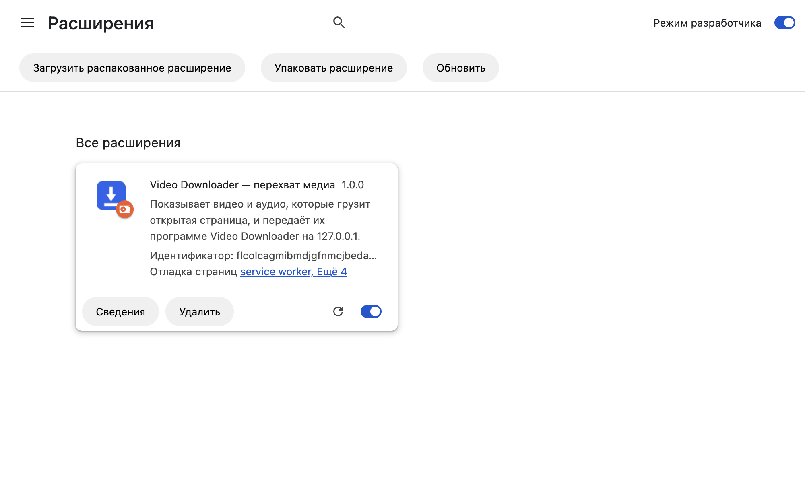
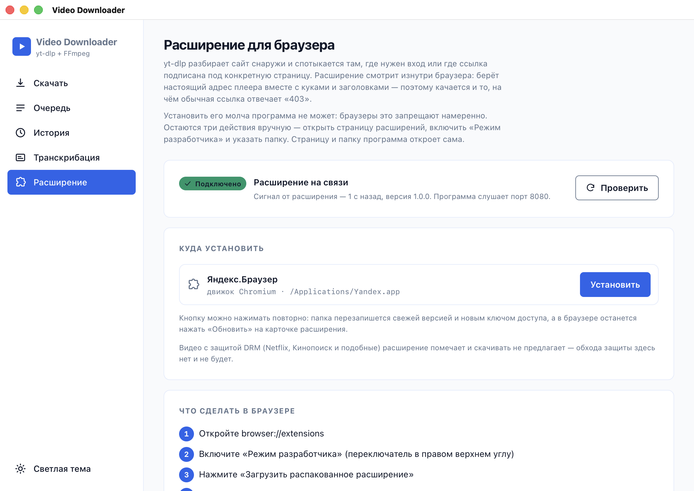
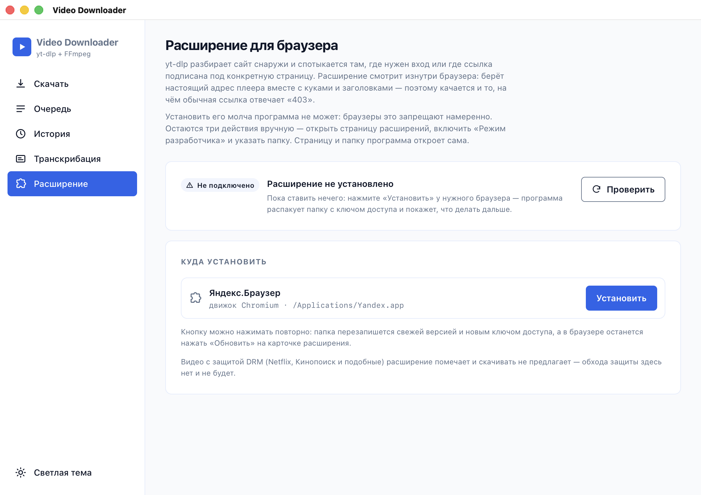
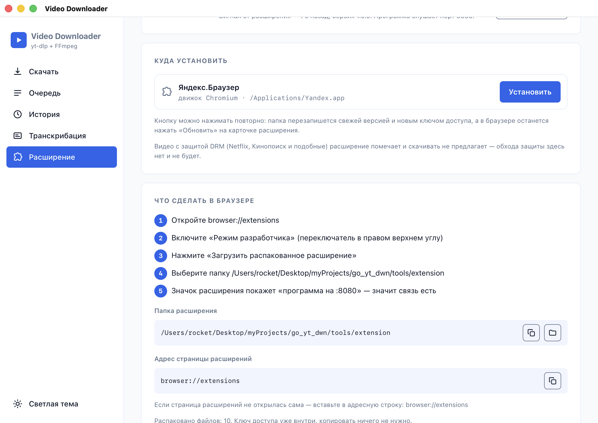
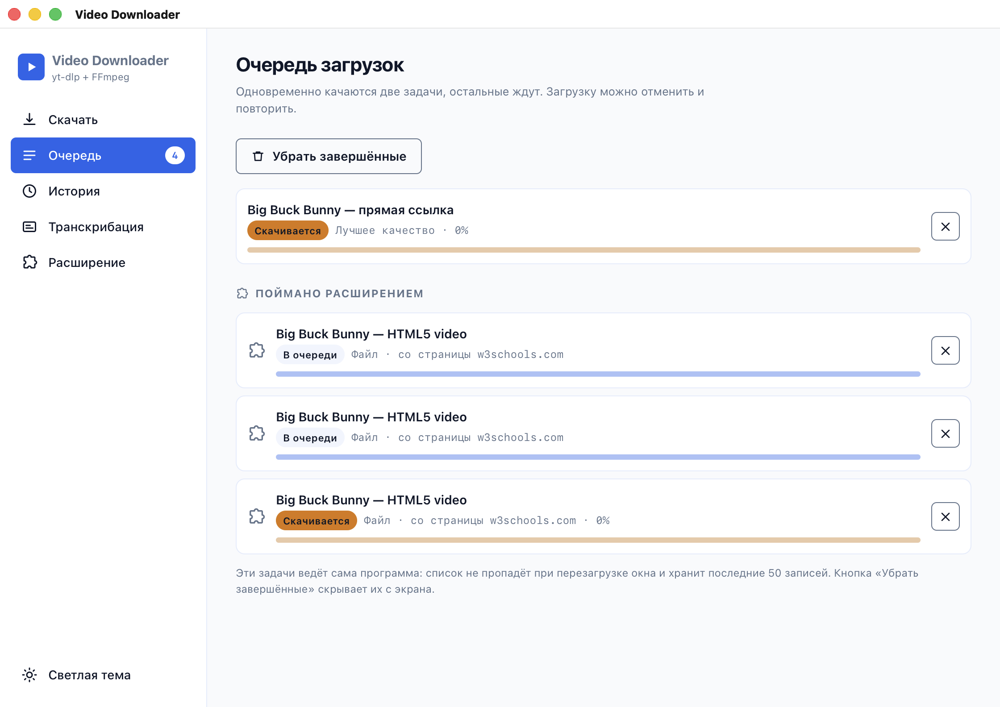
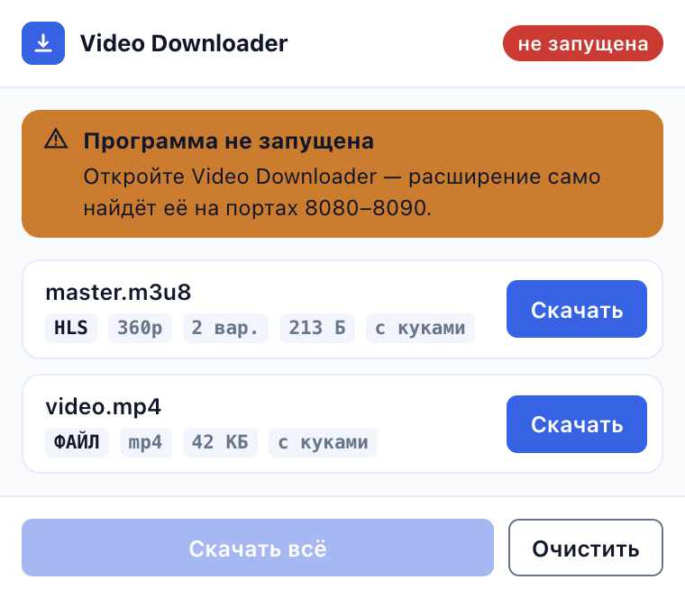

# Расширение браузера — «глаза» программы внутри страницы

`yt-dlp` разбирает сайт снаружи, по заранее написанным правилам: он ломается на
неизвестных сайтах, коротких подписанных ссылках и там, где нужен вход. Расширение
живёт внутри сессии браузера и видит реальные запросы плеера — адреса приходят уже
с куками, заголовками и подписями. Программа остаётся «компаньоном»: качает и склеивает.

**DRM не поддерживается и поддерживаться не будет.** Netflix, Кинопоиск и другие
защищённые сервисы (Widevine, PlayReady, FairPlay) помечаются меткой «DRM», кнопки
скачивания у них нет. Расшифровки, обхода EME и работы с ключами здесь нет.



## Как это устроено

```
браузер ──(webRequest, только наблюдение)── расширение ──POST /api/capture──> программа
                                                 │                               │
                                          popup со списком                 очередь загрузок
                                          найденного медиа                 (yt-dlp + ffmpeg)
```

| Часть | Файл | Что делает |
| :-- | :-- | :-- |
| Service worker | [`extension/background.js`](../extension/background.js) | Слушает `webRequest`, копит находки по вкладкам, разбирает манифесты, шлёт задачи программе |
| Popup | [`extension/popup.*`](../extension/) | Список найденного, кнопки «Скачать» / «Скачать всё», состояния |
| Ключ доступа | [`extension/config.js`](../extension/config.js) | Токен и порт; **заполняет программа при распаковке** |
| Сервер | [`capture.go`](../capture.go), [`extension.go`](../extension.go) | Токен, приём находок, очередь загрузок, распаковка расширения |
| Поиск браузеров | [`browsers.go`](../browsers.go) | Где установлены браузеры и как открыть их страницу расширений |

Расширение **вшито в бинарник программы** (`//go:embed extension`) и распаковывается
в `tools/extension` рядом с yt-dlp и ffmpeg. В систему ничего не ставится, интернет
для установки не нужен.

## Установка

1. В программе нажать «Расширение» (ручка `POST /api/extension/install`). Программа
   распакует папку `tools/extension`, впишет в `config.js` ключ доступа и порт,
   откроет страницу расширений браузера и саму папку в Finder/Проводнике.
2. В браузере включить **«Режим разработчика»**.
3. **«Загрузить распакованное расширение»** → выбрать папку `tools/extension`.
4. В popup появится зелёная плашка «программа на :8080».



### Экран «Расширение» в программе

Раздел показывает найденные браузеры, состояние связи и инструкцию. Индикатор
наверху опрашивает `/api/extension/status`, пока раздел открыт: «Подключено» —
это `connected` (расширение отзывалось последние две минуты), рядом — сколько
секунд назад пришёл сигнал и на каком порту слушает программа.



До первой установки раздел выглядит так — папки ещё нет, и это сказано прямо,
а не спрятано за серой плашкой:



После нажатия «Установить» программа распаковывает папку, открывает страницу
расширений и Finder, а на экране появляются шаги из `steps[]`, путь к папке и
адрес страницы — оба с кнопкой «скопировать». Это не украшение: Chromium умеет
проигнорировать внутренний адрес, переданный аргументом запуска, и тогда его
вставляют руками.



Задачи из расширения показаны отдельной секцией в разделе «Очередь». Смешивать
их с обычными нельзя: обычную задачу ведёт вкладка (SSE, отмена = закрыть поток,
есть повтор, при перезагрузке окна она исчезает), задачу из расширения ведёт
сервер (живёт без интерфейса, отменяется через `/api/capture/cancel`, повторить
нечем). В общем списке половина строк молча теряла бы кнопки.



В магазин расширение не публикуется — это осознанный выбор владельца, поэтому
установка ручная. После обновления программы папка обновляется автоматически при
следующем запуске; в браузере достаточно нажать «Обновить» на карточке расширения.

Для Firefox инструкция другая: `about:debugging` → «Загрузить временное дополнение» →
выбрать `manifest.json`. **До перезапуска браузера** — Firefox иначе не умеет
без подписи в AMO.

## Разрешения и зачем они

| Разрешение | Зачем |
| :-- | :-- |
| `webRequest` | Видеть адреса медиа и заголовки запроса плеера. Только наблюдение: трафик не меняется и не блокируется (блокирующий webRequest в MV3 недоступен и не нужен). |
| `storage` | Находки лежат в `chrome.storage.session` — это память, она не пишется на диск и стирается при закрытии браузера. Рабочий порт программы — в `chrome.storage.local`. |
| `<all_urls>` | Видео бывает на любом сайте. Это же разрешение даёт popup узнать адрес и заголовок активной вкладки, поэтому отдельное `tabs` не запрашивается. |
| `scripting` | Разовое чтение метаданных страницы ради превью: `og:image`, `twitter:image`, `poster` у `<video>`. Единственный вызов — `grabPageMedia` в `popup.js`, и только в момент открытия popup. |

Не запрашиваются: `downloads`, `cookies`, `tabs`, `nativeMessaging`, внешние домены.
Аналитики нет, единственный адресат данных — `127.0.0.1`.

**Постоянных контент-скриптов нет.** В `manifest.json` нет секции `content_scripts`:
код на странице исполняется только по факту открытия popup, разово, и только
читает три поля. Расширение и так видит весь трафик через `webRequest` — добавлять
к этому вечную инъекцию в каждую вкладку было бы вмешательством сверх нужного.

**Почему `scripting`, а не `activeTab`.** `chrome.scripting.executeScript` требует
разрешения `scripting` независимо от того, как получен доступ к странице;
`activeTab` его не заменяет, он выдаёт по жесту пользователя host-доступ к текущей
вкладке. Такой доступ у расширения уже есть из `<all_urls>` (без него не работает
`webRequest`), поэтому `activeTab` не убрал бы ни одной строки из списка
разрешений, а добавил бы свою. Минимальная добавка к манифесту — ровно `scripting`.

## Заголовки — главная часть

Ссылка из плеера почти всегда подписана под конкретный `Referer` и куки. Расширение
запоминает заголовки исходного запроса (`onSendHeaders` с `extraHeaders`, иначе Chrome
не покажет `Cookie`) и передаёт их программе, а та — в yt-dlp:

| Заголовок | Флаг yt-dlp |
| :-- | :-- |
| `Referer` | `--referer <значение>` |
| `User-Agent` | `--user-agent <значение>` |
| `Cookie` | `--add-header Cookie:<значение>` |
| `Origin` | `--add-header Origin:<значение>` |

Проверено на стенде, который отдаёт файл только с правильными `Referer` и `Cookie`:
без заголовков — `HTTP Error 403: Forbidden`, с заголовками — файл скачан целиком.

## Превью и выбор качества

### Разбор манифеста — на стороне расширения

Мастер-манифест почти всегда отдаётся только с куками и `Referer` страницы, поэтому
разбирает его расширение (`probeManifest` в `background.js`), а не программа: со
своего сокета она получила бы 403. Из `#EXT-X-STREAM-INF` берутся `RESOLUTION` и
`BANDWIDTH`, из DASH — `width`/`height`/`bandwidth` у `<Representation>`.
Длительность считается по `#EXTINF` самого лёгкого варианта (у мастера её нет)
или по `mediaPresentationDuration` в `.mpd`.

Варианты сворачиваются в список высот: одна строка на разрешение (одинаковые высоты
с разным битрейтом — не выбор, а шум), не длиннее восьми. Если вариантов было
больше, чем строк, в метках видно «N вар.». У прямого эфира (`#EXT-X-ENDLIST` нет)
длительность не показывается — вместо неё метка «эфир»: сумма сегментов в live
означает длину окна, а не длину записи.

### Как выбор доезжает до yt-dlp

Выбор уходит в `POST /api/capture` полем `quality` («720p»), из которого сервер
строит селектор форматов:

```
-f "bv*[height<=720]+ba/b[height<=720]/bv*+ba/b/best" --merge-output-format mp4
```

Отдельный адрес варианта не передаётся намеренно: в HLS звук часто лежит отдельной
дорожкой (`#EXT-X-MEDIA`), и плейлист варианта дал бы немое видео, а по высоте на
мастер-манифесте yt-dlp сводит картинку с нужным звуком сам. Для прямого файла
селектор форматов не добавляется вовсе — на нём он только мешает.

Последний выбор помнится в `chrome.storage.local` (`prefHeight`) и предлагается на
следующей находке: точное совпадение по высоте, иначе ближайшая снизу, иначе
«Лучшее».

### Превью: три источника, от дешёвого к дорогому

| Источник | Кто делает | Когда |
| :-- | :-- | :-- |
| `og:image`, `twitter:image`, `poster` у `<video>` | `chrome.scripting.executeScript` по активной вкладке, разово при открытии popup | всегда первым |
| Кадр из потока (ffmpeg) | программа, `POST /api/preview` | если картинки со страницы нет или она не загрузилась (403 без `Referer`) |
| Значок по типу источника | popup | если не вышло ни то, ни другое |

Картинка со страницы грузится обычным ``, то есть браузером и его кешем —
прокси для чужих доменов не строится. Проверка «загрузилась ли» — через
`Image.onload`: домен, отдающий 403, просто уводит на следующий источник.

Место под картинку в строке занято всегда (64×36), поэтому список не прыгает, пока
кадры едут. Кадры запрашиваются по одному, после отрисовки списка.

### Почему `/api/preview` — не открытый прокси

* Только `POST` с токеном. `GET /api/preview?url=…` можно было бы подставить в
  `` на любой странице — ручка стала бы «покажи что угодно с этой машины».
* Ответ — всегда перекодированный jpeg не шире 320px, никогда байты источника.
* Адрес не приходит из popup: popup передаёт service worker'у только `key` строки,
  а тот берёт URL из своего списка находок этой вкладки. Заказать превью адреса,
  которого в находках нет, нельзя даже из самого popup.
* ffmpeg берёт ровно один кадр (`-ss` до `-i` плюс `-frames:v 1`), весь файл не
  тянется; общий таймаут 8 с, `-rw_timeout` 5 с на молчащую сеть, одновременно не
  больше двух процессов.
* `-protocol_whitelist file,http,https,tcp,tls,crypto` — иначе по манифесту ffmpeg
  готов уйти в любой протокол, включая `file://`.
* Петлевые, link-local и multicast адреса запрещены: иначе ручкой можно щупать
  порты этой же машины и метаданные облака (169.254.169.254). Домашняя сеть
  (192.168.x, 10.x) разрешена намеренно — NAS с видео это рабочий сценарий.
* Кеш на диске (`tools/preview-cache`, ключ — origin+path без подписи в query),
  сутки на удачный кадр и 10 минут на метку неудачи: без неё popup дёргал бы
  ffmpeg каждые две секунды.

## Токен

Программа генерирует токен при первом обращении и хранит его в `tools/extension-token`
(права `0600`). При распаковке расширения токен впечатывается в `config.js` —
пользователю копировать нечего.

* Запрос без токена или с чужим токеном → **403** и подсказка «переустановите
  расширение из программы».
* Сравнение токенов — за постоянное время (`crypto/subtle`), чтобы его нельзя было
  подобрать по времени ответа.
* CORS: `Access-Control-Allow-Origin` выдаётся только источникам
  `chrome-extension://` и `moz-extension://`. Запрос со страницы обычного сайта
  отклоняется по `Origin`, даже если токен каким-то образом утёк.
* Служебные ручки (`/api/extension/*`, `/api/capture/jobs`, `/api/capture/cancel`,
  `/api/deps*`, `/api/reveal`) отвечают только если `Host` — локальный адрес.
  Это защита от DNS-rebinding: браузер подставит туда имя сайта, и запрос будет
  отклонён.
* Они же отклоняют запрос, если заголовок `Origin` есть и он не
  `http://127.0.0.1:…`, `http://localhost:…` или `http://[::1]:…`. Одного `Host`
  мало: кросс-сайтовый POST с телом `text/plain` уходит без предварительного
  `OPTIONS`, и `Host` в нём наш — то есть чужая вкладка могла бы перераспаковать
  папку расширения, запустить браузер или отменить чужую загрузку, даже не читая
  ответа. Запрос без `Origin` (curl, нативная оболочка) проходит: неброузерному
  клиенту машина и так открыта.

## HTTP-контракт

Все ручки — на локальном сервере программы.

### `GET /api/ping`

Без токена — popup должен уметь отличить «программа не запущена» от «ключ не подошёл».

```
GET /api/ping?from=ext&v=1.0.0&p=1
→ 200 {"app":"go_yt_dwn","version":"v1.0.1","protocol":1,"port":8080}
```

`from=ext` отмечает расширение как подключённое (это состояние показывает
`/api/extension/status`). Источник `https://любой-сайт` → **403**.

### `POST /api/capture`

```json
{
  "token": "…", "url": "https://cdn/master.m3u8",
  "pageUrl": "https://site/watch", "title": "Заголовок страницы",
  "kind": "hls|dash|file",
  "headers": {"referer": "…", "userAgent": "…", "cookie": "…", "origin": "…"},
  "size": 12345, "quality": "720p", "duration": 84, "drm": false,
  "protocol": 1, "extVersion": "1.0.0"
}
→ 200 {"ok":true,"queued":true,"id":"cap1785532809-1"}
→ 403 ключ не подошёл  ·  400 DRM или некорректная ссылка  ·  503 очередь переполнена
```

`quality` — выбор человека в popup, высота в пикселях с «p» («720p»). Пустая
строка означает «лучшее»: селектор форматов тогда `bv*+ba/b/best`. Поле аддитивное,
старое расширение без него работает как раньше. Для `kind: "file"` игнорируется.

### `POST /api/preview`

Один кадр из потока — для строки находки в popup.

```json
{"token": "…", "url": "https://cdn/master.m3u8", "kind": "hls|dash|file",
 "headers": {"referer": "…", "userAgent": "…", "cookie": "…", "origin": "…"}}
→ 200 image/jpeg (≤320px по ширине)
→ 204 кадра нет: ffmpeg не установлен, не смог или недавно уже не смог
→ 403 ключ не подошёл / чужой Origin / адрес петлевой или link-local
→ 405 не POST  ·  400 некорректная ссылка
```

Ошибку человеку не показываем: 204 — это «останется заглушка», и всё.

### `GET /api/capture/jobs`

Очередь загрузок из расширения — для интерфейса программы.

```json
{"connected": true, "lastPing": 3, "extVersion": "1.0.0",
 "jobs": [{"id":"…","title":"…","url":"…","pageUrl":"…","kind":"hls",
           "source":"extension","state":"queued|downloading|done|error|canceled",
           "percent":42,"speed":"1.20MiB/s","eta":"00:12","file":"…","error":"","created":1785532809}]}
```

### `POST /api/capture/cancel`

```
{"id":"cap…"} → 200 {"ok":true} · 404 задача не найдена или уже завершена
```

### `GET /api/extension/status`

```json
{"ready": true, "dir": "…/tools/extension",
 "browsers": [{"id":"yandex","name":"Яндекс.Браузер","path":"/Applications/Yandex.app",
               "engine":"chromium","extPage":"browser://extensions","temporary":false}],
 "connected": true, "lastPing": 3, "extVersion": "1.0.0",
 "protocol": 1, "extProtocol": 1, "mismatch": false, "port": 8080}
```

### `POST /api/extension/install`

```json
{"browser": "yandex", "openPage": true, "openFolder": true}
→ {"dir":"…","files":10,"browser":{…},"extPage":"browser://extensions",
   "pageLaunched":true,"folderLaunched":true,
   "note":"Если страница расширений не открылась сама — вставьте в адресную строку: …",
   "steps":["Откройте …","Включите «Режим разработчика»…", …]}
```

Тело можно не передавать — тогда папка просто готовится, ничего не открывается.

`pageLaunched` и `folderLaunched` — именно «запущено», а не «открыто»: программа
знает только результат запуска процесса. Открылась ли вкладка со страницей
расширений, ей не сообщает никто — Chromium намеренно умеет игнорировать
внутренние адреса в аргументах запуска, поэтому адрес всегда показывается ещё и
текстом (`note`), чтобы его можно было вставить руками. Если запускать не просили
(`openPage:false` / `openFolder:false`), поля в ответе нет вообще — «не пытались»
и «пытались, не вышло» интерфейс должен различать.

## Порт: почему их бывает два

Нативное окно (macOS `.app`, Windows `.exe`) запускает сервер с `-addr 127.0.0.1:0`,
то есть на случайном порту. Расширение ищет программу только в диапазоне 8080–8090 —
иначе после каждого запуска его пришлось бы переустанавливать. Поэтому программа
дополнительно слушает первый свободный порт диапазона и обслуживает на нём те же
обработчики. Если весь диапазон занят другой копией программы, в консоль выводится
предупреждение, а расширение работает с той копией.

## Границы и известные ограничения

| Ситуация | Поведение |
| :-- | :-- |
| Программа не запущена | Красная плашка и подсказка в popup; порты 8080–8090 перебираются заново по кнопке |
| DRM-манифест | Метка «DRM», кнопки скачивания нет; сервер такой запрос тоже отклоняет (400) |
| Много вкладок | Списки не смешиваются; при закрытии вкладки её записи стираются |
| Переход на другую страницу | Список вкладки очищается (смена только `#` — не считается) |
| Мастер-манифест и его варианты | Показывается один мастер, качество выбирается списком в самой строке |
| Вариантов больше восьми (live-манифесты) | Список свёрнут до одной строки на разрешение и обрезан до восьми; сколько было всего — видно в метке «N вар.» |
| Превью не получилось | Заглушка по типу источника; место под картинку занято всегда, строка не прыгает |
| Вкладку закрыли, пока popup открыт | Метаданные страницы читаются один раз при открытии, дальше popup работает с тем, что успел взять |
| Сегменты `.ts` / `.m4s` | Не показываются по одному; если манифест не попался, popup честно пишет, сколько сегментов видел, и просит обновить страницу |
| Приватные окна | Расширение в них по умолчанию не работает — так и оставлено |
| Версии разошлись | `/api/ping` отдаёт `protocol`; расхождение — предупреждение в popup |
| Два потока с одной страницы | Имена файлов различаются: «Заголовок — master.mp4», «Заголовок — video.mp4» |



## Проверка живьём (что было сделано)

* Яндекс.Браузер 26.6.3 (Chromium 148), расширение загружено режимом разработчика.
* На локальном стенде: пойман `master.m3u8` (качество `360p` разобрано из мастер-манифеста,
  2 варианта) и `video.mp4` (размер из `Content-Length`), у обоих — `Referer`, `User-Agent`
  и `Cookie` страницы.
* «Скачать всё» → две задачи в очереди программы → два файла на диске; HLS собран
  ffmpeg'ом в mp4 640×360 со звуком.
* Реальный сайт (w3schools): пойман и скачан HLS-поток на 1:24 — файл 1,9 МБ.
* Запрос без токена и запрос с `Origin` обычного сайта → 403.

### Выбор качества доезжает до файла

Стенд: мастер-манифест на три варианта (1280×720, 640×360, 426×240), ролик 20 с
со звуком, отдаётся локальным http-сервером. Три задачи через настоящий
`POST /api/capture` с одним и тем же URL и разным полем `quality`:

| `quality` | Разрешение итогового mp4 | Размер | Длительность | Звук |
| :-- | :-- | --: | :-- | :-- |
| `""` (лучшее) | 1280×720 | 6 818 572 Б (6,5 МБ) | 00:00:20.04 | aac |
| `"360p"` | 640×360 | 2 520 245 Б (2,4 МБ) | 00:00:20.04 | aac |
| `"240p"` | 426×240 | 1 008 179 Б (0,96 МБ) | 00:00:20.04 | aac |

То есть выбор влияет именно на скачанный файл, а не только на подпись в
интерфейсе; звук на месте во всех трёх — ради этого выбор и передаётся высотой на
мастер-манифест, а не адресом варианта.

То же самое, но руками попапа (Яндекс.Браузер, расширение загружено в временный
профиль, стенд отдаёт `240p / 480p / 720p`): в списке качества
`Лучшее · 720p · 2.9 Мбит · 480p · 1.1 Мбит · 240p · 436 кбит`.

| Что выбрали в попапе | Файл на диске |
| :-- | :-- |
| `240p · 436 кбит` | 426×240, 968 000 Б |
| `Лучшее` | 1280×720, 1 424 805 Б |

«Скачать всё» тоже идёт по выбору строк: с `480p` у HLS в очередь ушли обе
находки, и на диске оказались HLS 854×480 (2 420 438 Б) и прямой `src.mp4`
как есть, 1280×720 (936 051 Б) — у файла выбирать нечего, селектора у него нет.

Превью кадром из программы проверено на странице без `og:image` и без `poster`:
в строке оказалась картинка `data:image/jpeg;base64,…`, то есть ответ
`/api/preview`, а не адрес со страницы.

### Ручка превью

* HLS-мастер со стенда → `200 image/jpeg`, кадр 320×180, 6 076 Б.
* Повторный запрос того же адреса — из кеша, 0,00 с (ffmpeg не запускается).
* `http://127.0.0.1:…` → **403** (петлевой адрес запрещён), `GET` вместо `POST` →
  **405**, чужой токен → **403**, `Origin: https://evil.example` → **403**.

**Что не удалось проверить:** YouTube — с этой сети Google отдаёт страницу «подозрительный
трафик» (капча) вместо видео, поэтому smoke-тест на нём не выполнен. Ограничение сети,
а не расширения.

**Флаг `--load-extension` больше не работает** в Chromium 137+ (и в Яндекс.Браузере на
его основе): расширение ставится только через «Режим разработчика» в интерфейсе.
Поэтому программа помогает установкой, а не делает её сама.
